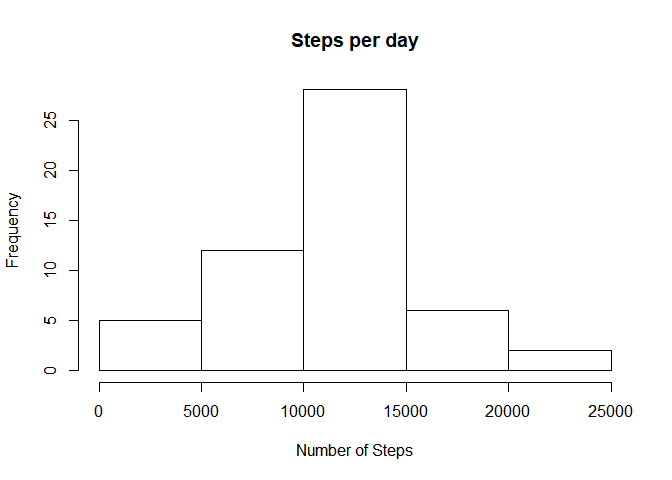
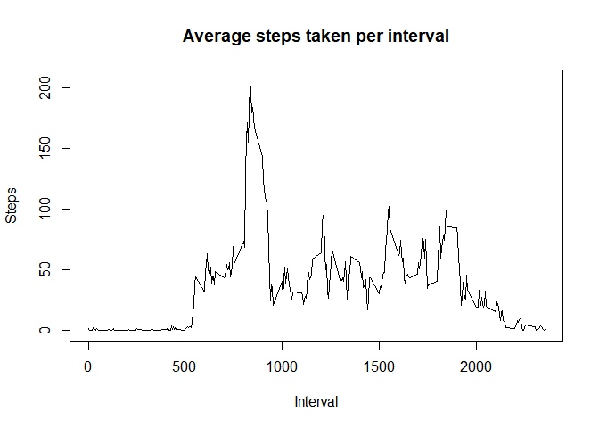
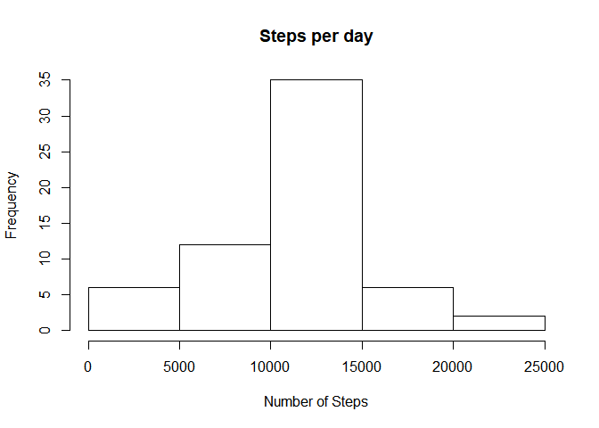
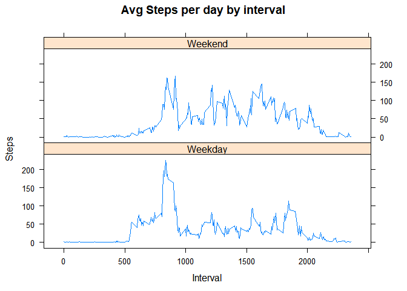

### About

This project is a component of the Reproducable Research course in the
Data Science Specialization. It will demonstrate how to load and process
data in a literate statistical programming fashion.

### Loading and reading data

Data is downloaded directly from the link in the assignment. It is
17,568 obeservations

Variables include steps, date, and interval.

-   **Steps**: Number of steps in a 5 minute interval

-   **Date**: The date on which the measurement is taken

-   **Interval**: Identifier for the 5 minute interval in which the
    measurement is taken

<!-- -->

    temp <- tempfile()
    download.file("https://d396qusza40orc.cloudfront.net/repdata%2Fdata%2Factivity.zip",temp)
    unzip(temp)
    unlink(temp)
    activitydata <- read.csv("activity.csv")

### Create Histogram for total steps per day

This will group stepb sy day, produce a histogram, and calculate summary
statistics

    daily_steps <- aggregate(steps ~ date, activitydata, sum)
    hist(daily_steps$steps, main = paste("Steps per day"),xlab="Number of Steps")

\#\#\# Display the mean and median number of steps taken each day

    themean <- mean(daily_steps$steps)
    themedian <- median(daily_steps$steps)

The `mean` is 1.076618910^{4} and the `median` is 10765

### Create time series plot of the average number of steps taken

    interval_steps <- aggregate(steps ~ interval, activitydata, mean)
    plot(interval_steps$interval,interval_steps$steps,type="l",xlab="Interval", ylab="Steps", main="Average steps taken per interval")

### The 5-minute interval that, on average, contains the maximum number of steps

    max_inter <- interval_steps[which.max(interval_steps$steps),1]

The interval that, on average, contains the larges number of chunks is
835.

### Code to describe and show a strategy for imputing missing data

Imputation of the average for that particular interval. Whatever the
average for that interval was for the non-missing vlaues will be
imputed. Drop 2012-10-01 becasue the data would calculate average
incorrectly

    missing_data <- sum(!complete.cases(activitydata))
    imputed_data <- transform(activitydata, steps = ifelse(is.na(activitydata$steps),interval_steps$steps[match(activitydata$interval,  interval_steps$interval)],activitydata$steps))

    imputed_data[as.character(imputed_data$date) == "2012-10-01",1] <-0

### HIstogram of the total number of steps taken each day after imputation

    daily_steps_2 <- aggregate(steps ~ date, imputed_data, sum)
    hist(daily_steps_2$steps, main = paste("Steps per day"),xlab="Number of Steps")

### Create a panel plot comparing the average number of steps taken per 5-minute interval across weekdays and weekends

    weekdays <- c("Monday", "Tuesday", "Wednesday", "Thursday", "Friday")
    imputed_data$dow = as.factor(ifelse(is.element(weekdays(as.Date(imputed_data$date)),weekdays),"Weekday", "Weekend"))
    interval_steps_imputed <- aggregate(steps ~ interval + dow, imputed_data, mean)
    library(lattice)
    xyplot(interval_steps_imputed$steps ~ interval_steps_imputed$interval | interval_steps_imputed$dow,  main="Avg Steps per day by interval", type="l", xlab="Interval", ylab="Steps", layout=(c(1,2)))

